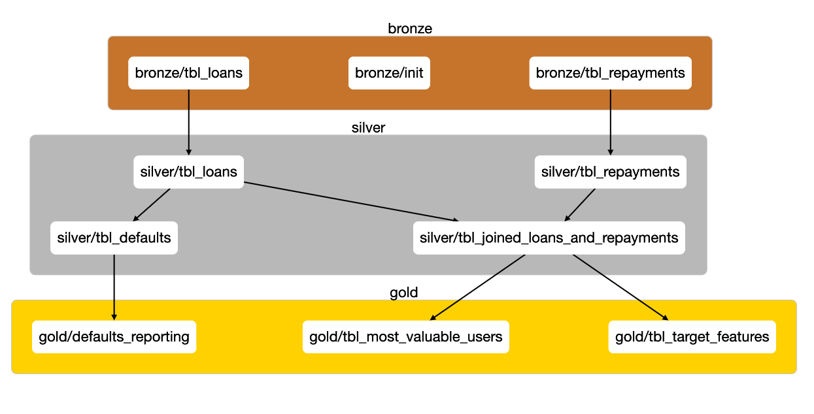

# Daipe Framework DEMO project

Welcome to [Daipe framework](https://daipe.ai/) DEMO project based on [Bondora P2P loans dataset](https://www.bondora.com/en/public-reports).

See [documentation](https://docs.daipe.ai/clone-demo-project/) to understand how to use this repository. 

## Project lineage


### To generate your own lineage

Run
```bash
daipe lineage publish html
```
and a folder `lineage` will be created in your project root.
